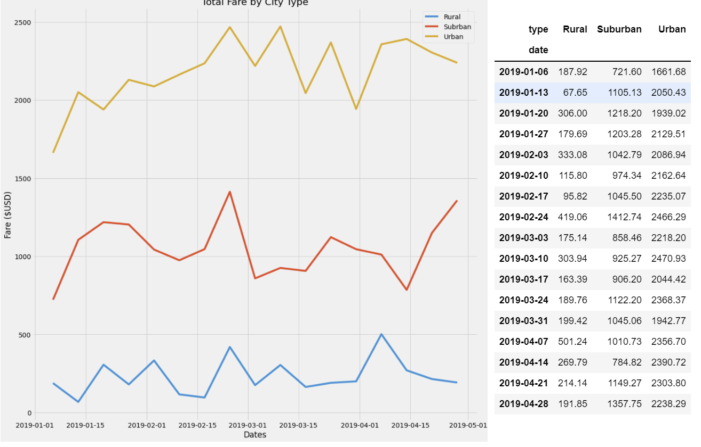

# Pyber_Analysis

## Overview of the Pyber Analysis
The purpose of this analysis was to understand the differences of ride-sharing data by city type, and how we can use those differences for decision making based the different areas. 

## Results of the Pyber Analysis
From our analysis, we can easily determine that Urban areas had higher total fares on average, most likely due to being larger populated areas. On the cotnrast rural areas had the lowest total fares due to less populated towns.
  
## Summary of the Pyber Analysis
